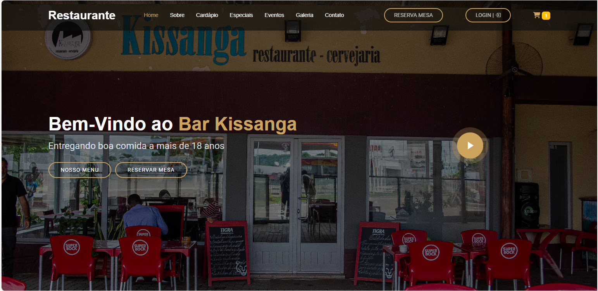
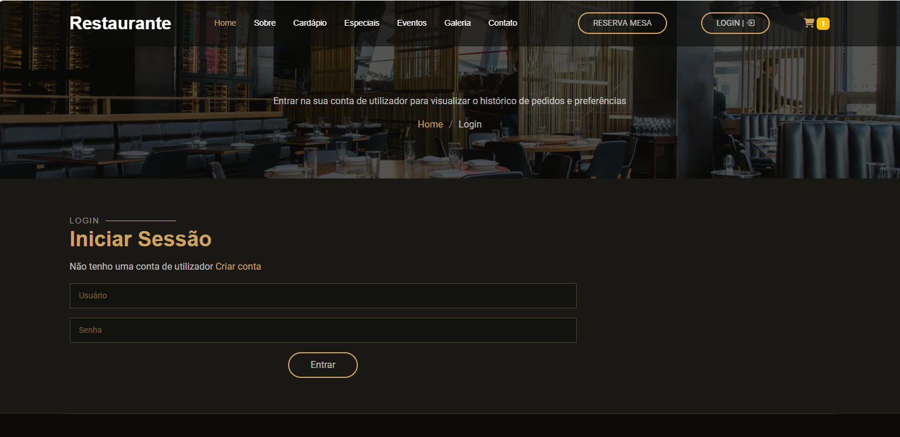
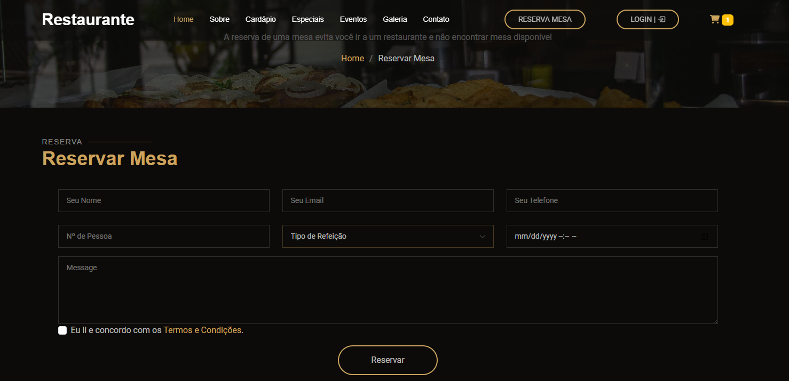
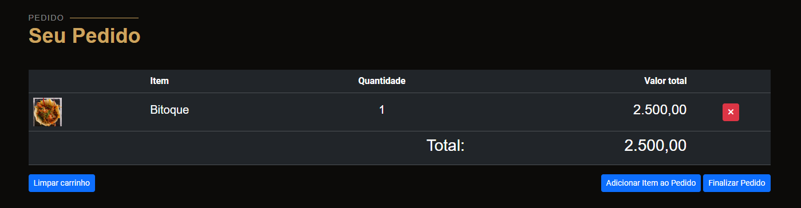

# Sistema de Reserva e Pedidos – Restaurante

Sistema web para gestão de **reservas de mesas** e **pedidos de clientes** em um restaurante.  
Desenvolvido em **PHP** com **MySQL**, focado em otimizar processos internos e melhorar o atendimento.

---

## Funcionalidades

- 👤 Cadastro de clientes  
- 📅 Reserva de mesas  
- 🧾 Registro de pedidos por mesa  
- 💸 Pagamento da taxa de reserva  
- 🔍 Consulta de reservas e pedidos em tempo real  
- 🛠️ Área administrativa completa  

---

## Tecnologias Utilizadas

[]()
[]()
[]()
[]()
[]()
[]()
[]()

---

## Requisitos

- **PHP 7.4 ou superior**
- **MySQL 5.7+**
- **Servidor local** (Laragon, XAMPP, WAMP, etc.)

---

## Estrutura do Projeto (MVC)

- **Model** – Responsável pela camada de dados do sistema  
- **View** – Apresentação e interação com o usuário  
- **Controller** – Camada intermediária que aplica regras de negócio  

---

## Demonstração

### Pagina Inicial


### Login


### Pagina de Reserva


### Pagina de carrinho


---

## Dados de Acesso (Admin)

- **Usuário:** admin@admin.com  
- **Senha:** 123456  

---

## Testar o Sistema

Para experimentar o sistema localmente, basta clonar este repositório:

git clone https://github.com/jobil05soft/restaurante.git

---

## Foco principal
Desenvolver soluções que facilitem e otimizem a gestão de reservas e pedidos em restaurantes.


```bash
